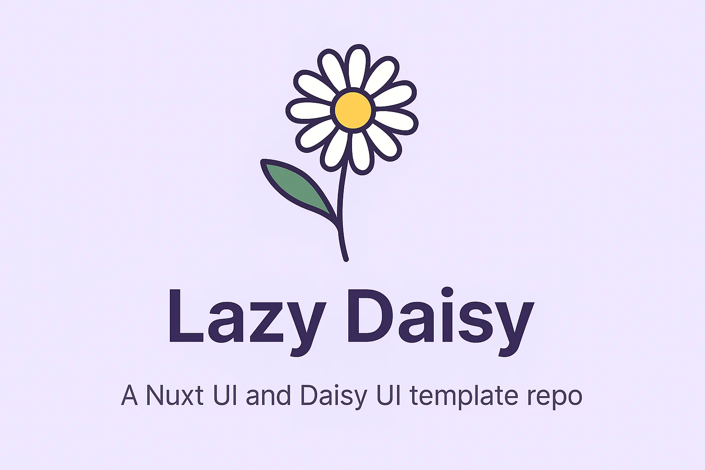

# Lazy Daisy



- ⚡ Nuxt 3 with Vite for fast development
- 🎨 DaisyUI for prebuilt Tailwind components
- 🔧 Built-in dark/light theme support
- 🧱 Scalable file structure for apps and dashboards
- 📁 Auto-imported components & composables
- ✅ ESLint + Prettier configured

## Why

I am lazy and like to have lots of micro-projects with the same stack.

[Nuxt documentation](https://nuxt.com/docs/getting-started/introduction)
[Daisy Ui Documentation](https://daisyui.com/)

## Setup

Make sure to install dependencies:

```bash
# npm
npm install
```

## Development Server

Start the development server on `http://localhost:3000`:

```bash
# npm
npm run dev

# pnpm
pnpm dev

# yarn
yarn dev

# bun
bun run dev
```

## Production

Build the application for production:

```bash
# npm
npm run build

# pnpm
pnpm build

# yarn
yarn build

# bun
bun run build
```

Locally preview production build:

```bash
# npm
npm run preview

# pnpm
pnpm preview

# yarn
yarn preview

# bun
bun run preview
```

Check out the [deployment documentation](https://nuxt.com/docs/getting-started/deployment) for more information.
